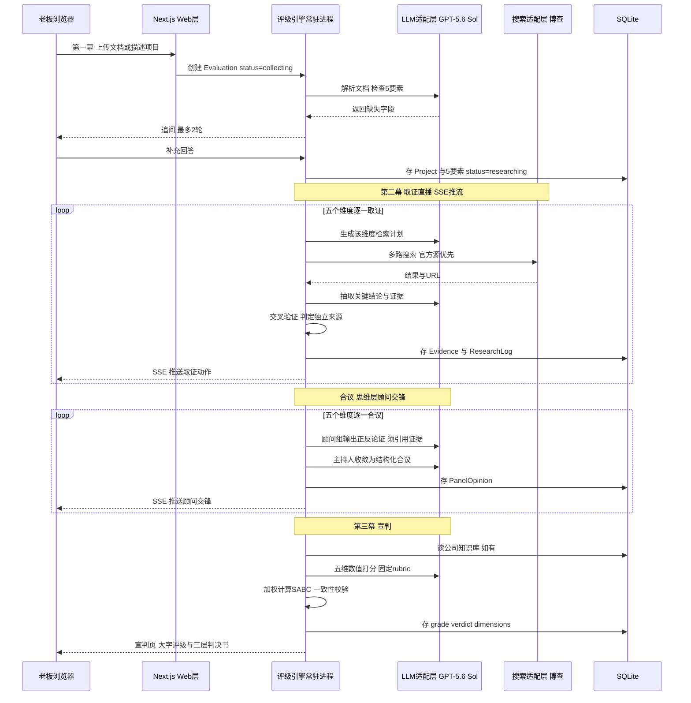
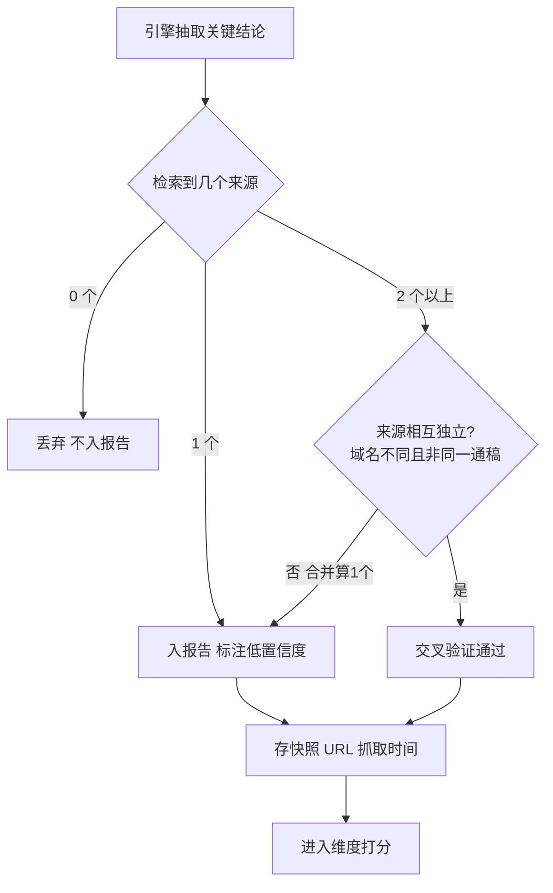

# PRD — 立项裁判（SABC 项目评级智能体）

> 状态：MVP 规格已冻结，等待开发指令
> 存档日期：2026-08-16（v1.1 新增思维层·顾问合议庭；v1.2 补全功能规格与验收标准）
> 产出方式：五阶段产品设计对话（愿景 → 边界 → 体验 → 技术 → 输出）
> 注：产品名"立项裁判"为工作代号，可随时更换

---

## 一、产品路线图

### 1. 核心目标（Mission）

> 把"拍脑袋立项"变成"看证据立项"——每一个项目决策，都有一份可验证、可追溯、敢拿给任何人看的 SABC 判决书。

### 2. 用户画像（Persona）

| 维度 | 内容 |
|---|---|
| 是谁 | 国内中小企业的老板/决策人，首批聚焦**电商行业** |
| 场景 | 员工提了新项目提案，或老板自己冒出想法；公司资源有限，做错一次代价几十万起 |
| 现状 | 问朋友（太主观）、问 ChatGPT（顺着说、无证据、不敢信）、自己调研（没时间没方法） |
| 核心痛点 | **不是得不到答案，是得到的答案不敢信** |
| 付费逻辑 | 一次评级几十到几百元 ≪ 一次错误立项几十万 |
| 长期形态 | B 端产品：目标是被公司嵌入立项流程，成为必经环节 |

**差异化根基（vs ChatGPT 免费回答）：**
1. 可验证的证据链——每个结论附来源、链接、抓取时间、置信度
2. 公司背景知识库——"对你们公司而言"的定制判断，而非泛泛的市场判断

### 3. V1：最小可行产品（MVP，按优先级排序）

| 优先级 | 功能 | 说明 |
|---|---|---|
| P0 | 评级引擎 | 固定五维（市场空间/竞争格局/入场时机/公司匹配度/投入产出比）加权得出 SABC；联网取证 = 博查搜索 API + 免费官方源（国家统计局/巨潮资讯/百度指数/公开行业报告）；MVP 不采购垂直数据 |
| P0 | 思维层·顾问合议庭 | 每维度 2 位固定思想家 + 1 位电商行业列席顾问（黄峥）：基于同一证据集输出正反论证与质疑，主持人协议强制收敛；**顾问只论证、不打分**。7 位移植自"私董会"DNA 档案（MIT），王慧文/黄峥/波特 3 位开发期用女娲新蒸馏 |
| P0 | 证据链报告 | 三层裁决书：第一屏大字判决 → 五维章节（结论前置）→ 可展开证据条目（来源/链接/时间/置信度标签） |
| P0 | 提案输入 | ChatGPT 式对话 + 文档上传（PDF/Word/PPT）；5 要素收口（做什么/卖给谁/怎么赚钱/预计投入/上线时间）；最多追问 2 轮；不做表单 |
| P1 | 直播取证 | SSE 实时推流取证动作："正在检索……正在交叉验证……发现矛盾，启动第三来源核查……" |
| P1 | 公司知识库 | 引导式五块档案（主营业务/团队能力/可投入资源/战略方向/红线）+ 自由上传任意资料，评级时全量读取；**可跳过**，跳过则公司匹配度灰显"未评估" |
| P2 | 双项目对比 | 档位二：维度分数并排表；入口在项目列表页勾选两个已评级项目 |
| V1.5 | 语音输入 | 第一幕的麦克风输入（Web Speech API 或模型 ASR），MVP 先文本+文档 |

### 4. V2 及以后（Future Releases）

- 多角色权限（员工提交、老板评审）+ 审批流集成
- 防刷分机制：评级历史不可删改、复评留痕（中立裁判原则）
- 资源裁决式对比（档位三："在你当前资源下建议选哪个、放弃另一个的代价"）
- 垂直数据源接入（按客户主战场选）：
  - 蝉妈妈（抖音电商）：企业版约 ¥824/月 起，API 从该档开放
  - 魔镜洞察（淘系/京东/拼多多类目销售额）：企业订阅数万~数十万/年
- 自定义评分维度与权重
- 自定义合议庭（女娲方法论产品化）：客户能提供一手素材（历史决策记录/内部讲话/结构化访谈）时，把老板本人蒸馏成专属列席顾问（含历史决策回放验证）；无素材客户使用内置行业席
- 历史评级管理与项目复评追踪
- 私有化部署选项（配合切换国内模型）

### 5. 关键业务规则（Business Rules）

1. **判决定义（已定稿）：**
   - **S = 立即立项**：五维全绿，窗口期就是现在
   - **A = 值得做，但有明确短板**：报告必须指出短板是什么、解决后才能升 S
   - **B = 不建议做**：投入产出比为负（做了基本亏），必须附测算依据
   - **C = 完全不可行**：致命缺陷（伪需求/法律红线/与公司能力完全错配），必须点名缺陷
2. **交叉验证：** 关键结论 ≥2 个独立来源（转载同一通稿算 1 个，独立性按域名+内容指纹判定）；不满足则强制标"⚠ 低置信度"；0 来源的结论不得入报告
3. **一致性：** 评级 = 五维数值分加权计算，权重固定、用户不可调（防刷分第一道防线）；同一输入复评分差必须小于阈值，超出自动重跑取中位数
4. **追问收口：** 5 要素齐了才启动评级；追问最多 2 轮；仍缺失的字段，对应维度标"基于假设推算，置信度降级"
5. **知识库缺失：** 公司匹配度灰显"未评估"，总评级只基于外部四维，页面明确提示"这是市场判断，不是为你公司定制的判断"
6. **证据留痕：** 每条关键数据存来源 URL + 抓取时间 + 内容快照（防链接失效，判决必须可复查）
7. **数据边界：** MVP 只用公开免费数据 + 通用搜索 API，报告如实标注来源级别（官方/媒体/自媒体）
8. **成本上限：** 单次评级硬上限 40 次搜索 + token 预算 + 固定合议轮次，超限降级取证深度并在报告中标注
9. **顾问不打分：** 思维层顾问只输出论证与质疑，维度分数仍由固定数值 rubric 计算——多视角服务判断质量，不得破坏一致性规则
10. **固定合议庭：** 每维度的顾问组合与发言轮次（立场→交锋→收敛，共 2 轮）写死在配置里，不随机轮换；同一项目复评面对同一批顾问
11. **论证必须引证：** 顾问立场必须引用证据编号；无证据支撑的意见强制标注"经验判断"，不参与置信度计算

### 6. 数据契约（Data Contract）

```typescript
Company {            // 公司知识库
  id
  profile: { mainBusiness, teamCapability, resources, strategy, redLines }  // 五块引导式档案
  extraDocs: Doc[]   // 自由上传，评级时全量读取
}

Project {            // 提案
  id, title
  essentials: { what, targetCustomer, revenueModel, budget, timeline }  // 5要素
  sourceDocs: Doc[]  // 上传的立项文档
  dialogue: Message[]  // 对话补充记录
}

Evaluation {         // 一次评级
  id, projectId, companyId?   // companyId 为空 = 跳过知识库
  status: collecting | researching | scoring | done | failed
  grade: S | A | B | C
  verdict: string             // 一句话判决
  dimensions: [5] { name, score, confidence, conclusion }
  shortboard?: string         // A级必填：可升S的短板
  fatalFlaw?: string          // C级必填：致命缺陷
  roiCalc?: string            // B级必填：投入产出测算依据
}

Evidence {           // 证据条目
  id, evaluationId, dimension
  claim, sourceName, sourceUrl, publishedAt, fetchedAt
  snapshot: string            // 内容快照（防链接失效）
  crossValidated: boolean
  confidence: high | low
}

PanelOpinion {       // 顾问合议记录
  id, evaluationId, dimension
  persona: string             // 顾问标识 nantian | jobs | taleb | ...
  stance: support | oppose | caveat
  argument: string
  evidenceRefs: EvidenceId[]  // 空数组 = 经验判断
}

ResearchLog {        // 直播动作流（SSE 数据源 + 留痕复盘，含取证与顾问交锋事件）
  evaluationId, step, actionText, timestamp
}

Comparison {         // 对比
  id, evaluationIds: [2], dimensionTable
}
```

---

## 二、选定原型：方案三"判决剧场"

> 备选方案一"对话流"（ChatGPT 式单栏）、方案二"卷宗工作台"（B端双栏）已淘汰。
> 选择理由：本产品卖的是信任，三幕式把取证过程和宣判仪式做成体验高潮，一次判决打动一个老板，且宣判画面自带传播力。

```
  第一幕·受理        第二幕·取证直播        第三幕·宣判
┌────────────┐   ┌────────────────┐   ┌────────────────┐
│            │   │ ▸ 检索艾瑞报告   │   │                │
│   拖入文档  │   │ ▸ 统计局数据 ✓  │   │       B        │
│     或     │ → │ ▸ 交叉验证中…   │ → │    不建议做     │
│  说出想法   │   │ ▸ 发现矛盾！    │   │                │
│            │   │ ▸ 启动三源核查  │   │  投入50万回报    │
│ ┌────────┐ │   │                │   │  不足20万       │
│ │开始评级 │ │   │  已核实 17 条   │   │                │
│ └────────┘ │   │  低置信  2 条   │   │ ↓ 滚动阅读判决书 │
└────────────┘   └────────────────┘   └────────────────┘
   极简全屏          全屏终端式滚动         黑屏大字揭晓
                   （作战室气氛）        再进入三层报告
```

**设计理念：** 把一次评级做成仪式：受理（全屏极简输入）→ 取证直播（全屏终端滚动，作战室氛围，等待变成节目）→ 宣判（黑屏亮出巨大评级字母，往下滚动进入完整三层判决书）。
**取舍：** 仪式感的代价是效率——项目列表、对比、知识库退居二级页面；重度用户的高频操作路径在 V2 优化。

### 已定稿的体验决策

| 决策点 | 结论 |
|---|---|
| 输入形态 | ChatGPT 式对话 + 文档上传；追问最多 2 轮；不做表单 |
| 等待体验 | 直播取证 + 顾问交锋（"Taleb 对回本测算提出异议…"）——过程本身就是信任来源，不做转圈加载 |
| 报告结构 | 三层：苹果式大字判决 → 麦肯锡式五维章节（结论前置）→ 天眼查式可展开证据条目 |
| 报告气质 | 裁决书。黑白灰底色，全页唯一强调色 = 评级色（S/A/B/C 各一色）；像法院判决，不像 PPT |
| 知识库 | 引导式五块档案，可跳过；跳过则匹配度灰显留钩子 |
| 对比入口 | 项目列表页勾选两个已评级项目 → 并排表 |
| 平台 | Web 优先，不做移动端优先设计 |

---

## 三、功能规格（Functional Spec）

### 1. 评分 rubric 与分级算法（业务规则 3 所引用的"固定 rubric"）

**维度权重（初始值，内测期用真实案例校准；用户不可调）：**

市场空间 25% ｜ 竞争格局 20% ｜ 入场时机 15% ｜ 公司匹配度 20% ｜ 投入产出比 20%

跳过知识库时：公司匹配度不评，其余四维权重等比归一化，报告标注"市场判断，非定制判断"。

**每维锚点（0-10 分，五档）：**

| 维度 | 10 分 | 7 分 | 5 分 | 3 分 | 0 分（触发致命标记） |
|---|---|---|---|---|---|
| 市场空间 | 百亿级且年增 >20%，多源验证 | 十亿-百亿级或稳定增长 | 亿级或增速平缓 | 市场萎缩或天花板 <亿级 | 伪需求：找不到任何付费证据 |
| 竞争格局 | 格局未定（CR3<30%）且壁垒可越 | 有强者但存在明确错位空隙 | 红海但分散，执行力可分羹 | 寡头垄断（CR3>70%） | 巨头核心腹地且无差异化 |
| 入场时机 | 红利拐点刚启动 | 趋势上行中段，窗口仍在 | 窗口模糊，先发优势不明显 | 红利尾声，获客成本飙升 | 窗口已关闭，用户心智已被占领 |
| 公司匹配度 | 能力/渠道直接复用，战略同向 | 多数能力可复用，缺口预算内可补 | 一半靠新建，团队需扩编 | 与主营几乎无协同 | 触碰公司红线或与战略冲突 |
| 投入产出比 | 回收期 <6 月且最坏损失可承受 | 回收期 6-18 月，安全边际清晰 | 18-36 月或依赖乐观假设 | 测算为负或 >36 月 | 最坏情况威胁公司现金流生存 |

**低置信度惩罚（业务规则 4 的数值化）：** 某维度关键结论中交叉验证通过的 <2 条 → 该维分数 ×0.9 并标注；基于假设推算的 5 要素字段 → 相关维度 ×0.9。

**分级判定（顺序执行，与业务规则 1 的判决定义自洽）：**

1. 任一维度触发致命标记（0 分档条件）→ **C**（一票否决，报告点名缺陷）
2. 投入产出比 <4 → 最高 **B**（对应"做了基本亏"，附测算依据）
3. 加权总分 ≥8.0 且五维全 ≥6 且关键结论全部交叉验证通过 → **S**
4. 加权总分 ≥6.5，或达到 S 分数线但存在 <6 的短板维度 → **A**（报告点名短板及升 S 条件）
5. 其余 → **B**

**一致性参数：** 打分 temperature ≤0.3；同证据集复算总分极差 >0.5 → 自动重跑 3 次取中位数（业务规则 3 的阈值具体化）。

### 2. 各维度取证清单（researcher 检索规格）

| 维度 | 标准检索问题（每题一个检索计划） | 主要信号源 |
|---|---|---|
| 市场空间 | 市场规模及统计口径；近 3 年增速；真实付费/销量证据 | 行业报告公开摘要、统计局、上市公司财报、电商公开销量信号 |
| 竞争格局 | 头部玩家与份额；近 2 年融资与新进入者动态；差异化空隙在哪 | 公开报道、财报、企业信用信息公示 |
| 入场时机 | 政策与监管动向；渠道/技术红利变化；需求热度拐点 | 政府官网、百度指数、媒体报道 |
| 公司匹配度 | 该赛道成功者的能力画像（与知识库对照） | 知识库（主）、公开报道（辅） |
| 投入产出比 | 行业成本基准（获客成本/客单价/毛利）；可比项目回收期案例 | 行业报告、财报、创始人公开访谈 |

每维度搜索预算 ≤8 次（5 维 × 8 = 40 次上限，与业务规则 8 吻合）。

### 3. 追问问题库（intake 规格）

**第一轮（5 要素标准问法，缺哪问哪）：**

- 做什么："用一句话说清：这个项目做什么、以什么形态交付？"
- 卖给谁："掏钱的人是谁？他们现在怎么解决这个问题？"
- 怎么赚钱："收费方式是什么？大致单价多少？"
- 预计投入："打算投多少钱、多少人？"
- 上线时间："期望多久上线或见效？"

**第二轮：** 仅针对仍缺失或相互矛盾的字段，问题从对应维度顾问的签名拷问生成（见思维层设计）。两轮后仍缺 → 按业务规则 4 标注降级，不再纠缠。

### 4. 关键状态与边界情况

| 场景 | 处理 |
|---|---|
| 文档解析失败（扫描件/加密） | 提示改为粘贴文本，流程不阻塞 |
| 取证中断（搜索/模型连续失败） | Evaluation 置 failed，宣判位显示"取证中断"+ 一键重跑，不重复计费 |
| SSE 断线 | 自动重连，从 ResearchLog 最后一步续播；关页重进同样续播 |
| 首页空态 | 展示一份预置示例判决书，让新用户 3 秒看懂产品输出什么 |
| 并发保护 | 单公司同时进行中的评级 ≤2 个 |

### 5. 账号与商业化（MVP 默认，定价待实验）

- **账号：** 手机号验证码登录；MVP 单账号 = 单公司，companyId 数据隔离从 Day 1 落在数据模型里
- **计费：** 内测期邀请码制免费（换深度访谈反馈）；V1.5 上按次付费（定价锚 ¥99-299/次，做价格实验）；订阅制随 V2 多角色功能上线

---

## 四、架构设计蓝图

### 1. 技术栈总览

| 层 | 选型 |
|---|---|
| 全栈框架 | Next.js（App Router，TypeScript），单体应用 |
| 部署 | 阿里云 ECS 常驻 Node 进程（`next start`）+ nginx；域名备案；MVP 为 SaaS 单机 |
| 模型 | GPT-5.6 Sol，经统一模型适配层（AI SDK），可一行配置切换 DeepSeek/GLM |
| 搜索 | 博查 Web Search API（主力）；智谱 Web Search（0.01-0.05元/次）做备胎 |
| 思维层 | 顾问人格 prompt 资产（提炼自私董会 DNA 档案 + 女娲蒸馏方法论，均 MIT 许可）+ 主持人编排协议 |
| 数据库 | SQLite + Drizzle ORM（预留 Postgres 迁移路径） |
| 文件 | 本地磁盘 uploads/（V2 迁 OSS）；PDF/Word/PPT 用 pdf-parse / mammoth / officeparser 抽文本 |
| 实时 | SSE（Server-Sent Events）推送取证直播 |
| 单次成本 | 约 5-20 元/次（顾问合议跑轻量档模型，主持与终审用 GPT-5.6 Sol）；切国内模型后约 2-5 元/次 |

### 2. 核心流程图



### 3. 交叉验证数据流（信任核心）



### 4. 代码库结构与组件交互

**本项目为全新代码库（当前工作区的数字人技能库与本产品无关，零改动）。**

```
sabc-judge/
├── app/                              # Next.js App Router（UI + API）
│   ├── page.tsx                      # 第一幕：受理（全屏输入）
│   ├── evaluation/[id]/research/     # 第二幕：取证直播（SSE 消费端）
│   ├── evaluation/[id]/verdict/      # 第三幕：宣判 + 三层判决书
│   ├── projects/                     # 二级页：项目列表 + 对比勾选
│   ├── compare/                      # 维度分数并排表
│   ├── knowledge/                    # 二级页：知识库引导（五块档案）
│   └── api/
│       ├── intake/                   # 提案输入与追问对话
│       ├── evaluations/[id]/stream/  # SSE 端点（从 ResearchLog 续播）
│       └── knowledge/
├── engine/                           # 评级引擎（纯逻辑，与 UI 解耦）
│   ├── orchestrator.ts               # 状态机 collecting→researching→scoring→done
│   ├── intake.ts                     # 5要素收口 + ≤2轮追问策略
│   ├── researcher.ts                 # 按维度定检索计划→搜索→抽取结论
│   ├── validator.ts                  # 独立来源判定 + 置信度标注
│   ├── scorer.ts                     # 五维数值打分 + 加权 + 一致性校验
│   ├── reporter.ts                   # 判决书结构化 JSON
│   ├── minds/                        # 思维层（顾问合议庭）
│   │   ├── personas/                 # 顾问人格档案（开发期用女娲流程蒸馏校准）
│   │   ├── panel.ts                  # 每维度顾问组：立场→交锋→收敛（固定2轮）
│   │   └── facilitator.ts            # 主持人协议：控轮次、防跑偏、产出结构化合议
│   └── sources/                      # 信号源适配器（可插拔）
│       ├── types.ts                  # SourceAdapter 接口 ← V2 蝉妈妈/魔镜从这插入
│       ├── bocha.ts                  # 博查搜索（主力）
│       └── official.ts               # 统计局/巨潮/百度指数
├── lib/
│   ├── llm.ts                        # 模型适配层：GPT-5.6 Sol ⇄ 国内模型一行切换
│   ├── db.ts                         # Drizzle + SQLite（预留 Postgres 迁移）
│   └── parse.ts                      # PDF/Word/PPT 文本抽取
└── data/                             # SQLite 文件 + uploads/（V2 迁 OSS）
```

**调用关系：** 页面 → API 路由 → `engine/orchestrator`（常驻进程内异步执行）→ `sources` / `llm` / `db`。取证直播页从 `ResearchLog` 表续播，进程重启不丢现场。评级引擎不依赖任何 UI 代码，未来可独立抽成服务。

### 5. 技术选型与风险

| 选型 | 理由 | 主要风险 | 应对 |
|---|---|---|---|
| Next.js 全栈单体 + ECS 常驻进程 | 一人开发一种语言；SSE 需要长连接；评级任务长（分钟级）不适合 serverless | 评级任务跑一半进程崩溃 | 状态机每步落库，重启后标记 failed 可一键重跑 |
| GPT-5.6 Sol + 模型适配层 | 长链推理与证据综合能力最强 | 国内调用需中转（延迟/稳定性）；客户数据出境合规 | AI SDK 换厂商=改一行配置；客户提合规要求即切 DeepSeek/GLM；私有化部署配国内模型（V2） |
| 博查搜索为主力 | 国内直连、备案合规、中文搜索质量最好、专为 AI 设计 | 单一供应商依赖（挂了/召回不足） | SourceAdapter 可插拔，智谱 Web Search 做备胎；注意同一网页经两个引擎不算独立来源 |
| MVP 不买垂直数据 | 魔镜数万/年、蝉妈妈 ¥824/月起，MVP 用免费信号代理（财报/百度指数/公开报道） | 电商销售额数据精度不如付费源 | 报告如实标注来源级别；第一个付费客户确定主战场后再采购对应垂直源 |
| SQLite + Drizzle | 零运维，单机 MVP 够用 | 多租户并发瓶颈 | Drizzle 方言兼容，客户 >10 家时迁 Postgres |
| SSE 直播取证 | 比 WebSocket 简单，单向推送足够 | 网关掐断长连接 | 心跳 + 断线从 last step 续播（日志在库） |
| LLM 打分 vs 一致性规则 | 评级必须可复现（对比功能的前提） | 同一项目复评分差大，砸"裁判"招牌 | 数值 rubric 锚点 + 低 temperature + 同证据集复算，分差超阈值自动重跑取中位数 |
| 成本控制 | 单次评级成本 5-20 元 | 搜索/token 无上限导致成本失控 | 硬上限：40 次搜索 + token 预算 + 固定合议轮次；超限降级并在报告标注 |
| 私董会式合议（思维层） | 单模型打分易片面、顺着提案说；多视角对抗提升判断质量，"思想家交锋"也是产品记忆点 | 自由辩论引入随机性威胁一致性；token 膨胀 | 顾问不打分只论证；固定顾问组合 + 固定 2 轮；顾问跑轻量模型，终审用旗舰模型 |
| 引入外部 skill 资产 | 女娲/私董会方法论成熟且 MIT 许可 | 它们是 agent runtime 的 SKILL.md，不是可安装的 SDK | 移植为产品内 prompt 资产与编排代码；女娲只在开发期蒸馏顾问档案，不做运行时依赖 |

### 6. 思维层设计（顾问合议庭）

**来源与移植方式：**

| 资产 | 仓库 | 许可 | 在本产品中的角色 |
|---|---|---|---|
| 私董会 advisory-board | github.com/Backtthefuture/huangshu | MIT | **运行时协议移植**：12 位顾问 DNA 档案 + 主持人协议，改写为 `engine/minds/` 的 prompt 资产与编排代码 |
| 女娲 nuwa-skill | github.com/alchaincyf/nuwa-skill | MIT | **开发期造脑工具**：用其"调研→提炼→验证"蒸馏流程生产/校准顾问人格档案；不进运行时。V2 产品化为"自定义合议庭" |

> 重要澄清：这两个 skill 是给 agent runtime（Claude Code/Cursor 等）用的 SKILL.md，不是 SDK，不能直接"安装"进产品。移植的是方法论和人格档案内容。

**五维合议庭（固定配置，每维度 2 位 + 电商行业列席 1 位）：**

| 维度 | 合议庭 | 签名拷问 |
|---|---|---|
| 市场空间 | 王慧文 + 南添 | "市场天花板和集中度怎么算？规模效应在哪一层？" / "这个需求真的存在吗？" |
| 竞争格局 | 波特 + 毛泽东 | "五力里哪一力会绞死你？新进入者凭什么活？" / "主要矛盾在哪？根据地在哪？" |
| 入场时机 | 张一鸣 + Paul Graham | "这是更底层趋势的投射吗？" / "为什么是现在？两年前为什么不行？" |
| 公司匹配度 | Steve Jobs + 毛泽东 | "你敢对另外一百件事说不吗？" / "集中优势兵力，你兵力够吗？" |
| 投入产出比 | Taleb + Buffett | "最坏能坏到什么程度，你死不死？" / "安全边际在哪？" |
| **行业列席（全维度）** | 黄峥 | "供需哪一侧存在错配？你给哪群人省了什么钱、创造了什么确定性？" |

**行业列席机制：** 列席顾问五个维度都在场，由主持人在议题涉其专长（电商供需/平台生态/人群）时点名发言，不参与非专长维度——控制 token 的同时保证每单电商客户的评级都有行业视角。首批客户为电商行业，列席固定为黄峥；未来按客户行业扩充席位，属配置变更不动代码。

**顾问档案来源：** 南添/毛泽东/张一鸣/PG/Jobs/Taleb/Buffett 七位直接移植私董会 DNA 档案；三位新蒸馏（开发期用女娲流程一次性完成，公开语料充足）：王慧文（清华产品课全套记录：市场体量/时机/规模效应方法论）、黄峥（个人公众号文集+访谈：供需错配/性价比人群）、波特（《竞争战略》《竞争优势》+HBR 文章：五力/通用战略）。候补席（暂不蒸馏）：梁宁/克里斯坦森/杰弗里·摩尔/段永平/曾鸣/Munger。

**蒸馏方法（开发期流水线，移植自女娲的四阶段流程）：**

> 执行环境：开发期在 agent runtime（Cursor/Codex）中安装 nuwa-skill 直接跑蒸馏，产物转换为统一 schema 后存入 `engine/minds/personas/` 并纳入版本管理。蒸馏是 build-time 工序，运行时零依赖。

1. **语料采集：** 按四类采集——著作/长文、访谈对话、演讲/课程记录、表达样本；一手材料优先（王慧文=清华产品课记录，黄峥=公众号原文+访谈实录，波特=两部著作+HBR 原文）。每条语料记录出处，写入档案 provenance 区
2. **框架提炼（五件套）：** ①心智模型（他看项目先看什么）②决策启发式（可执行的 if-then 规则，如"回本期>18个月→质疑"）③分维度签名拷问（每维度 1-2 问）④表达 DNA（发言风格，让合议纪要"像他"）⑤反模式 + 诚实边界（他绝不说什么 / 此人格在哪些判断上不可信，主持人据此限制其发言范围）。**核心纪律：提炼 HOW they think，不是 WHAT they said，禁止语录复读**
3. **验证（入庭考试，不过不上岗）：**
   - 历史判断回放：选 3 个该人公开评判过的真实商业案例（隐去结论）让人格表态，立场方向与本人一致须 ≥ 2/3
   - 反模式测试：投喂 2 个明显触碰其红线的提案，人格必须表达反对
   - 维度锚定测试：确认发言聚焦所辖维度，不越界抢戏
4. **档位与成本：** 默认标准档蒸馏，验证不合格升深度档（全量一手语料）重蒸；单次蒸馏成本数美元到数十美元，3 位为一次性投入

**统一档案 schema（10 位顾问共用；私董会移植的 7 位也按此规范化）：**

```yaml
persona: wanghuiwen
seat: 市场空间           # 所辖维度，行业列席标 industry-seat
lenses: [...]            # 心智模型
heuristics: [...]        # if-then 决策规则
questions: {...}         # 分维度签名拷问
voice: ...               # 表达DNA
never: [...]             # 反模式
limits: [...]            # 诚实边界（主持人引用）
provenance: [...]        # 语料出处 + 蒸馏日期 + 档位 + 验证结果
```

**维护规则：** 语料重大更新或验证回归失败时重蒸；**任何 persona 变更必须触发一致性回归**（固定测试项目集复评，分差在阈值内才能发布）——防止"换脑"悄悄改变评级口径。

**合议流程（每维度固定 2 轮）：** 取证完成后，两位顾问基于同一证据集各自表态（支持/反对/警告，必须引用证据编号）→ 一轮交锋（针对对方论点）→ 主持人收敛为结构化合议（PanelOpinion 落库）→ 交给 scorer 按固定 rubric 打分。合议过程经 SSE 推入第二幕直播流（"Taleb 对回本测算提出异议"）。

**一致性保护（对应业务规则 9/10/11）：** 顾问不打分；合议庭组合与轮次固定；无证据的意见标"经验判断"。

**对追问阶段的增强：** 5 要素收口不变；第二轮追问的问题从对应维度顾问的签名拷问中生成（仍遵守 ≤2 轮上限）。

**对报告的增强：** 三层判决书的五维章节内新增"合议纪要"——顾问立场、关键异议、主持人结论，全部带证据引用。

---

## 五、MVP 验收标准

| 类别 | 指标 | 通过线 |
|---|---|---|
| 信任（核心假设） | 用 10 个已知实际结果的历史提案盲测，评级方向与结果比对 | 一致 ≥ 7/10 |
| 信任（用户侧） | 3 位目标客户老板完整阅读报告后的态度 | 均表示"敢作为决策参考" |
| 一致性 | 同一提案复评 3 次 | 等级零翻转，总分极差 ≤ 0.5 |
| 性能 | 单次评级端到端耗时 | P90 ≤ 10 分钟 |
| 成本 | 单次评级 API 成本 | ≤ 20 元 |
| 证据质量 | 报告关键结论带来源比例 / 交叉验证通过率 | 100% / ≥70% |

任何一项不达标，不进入付费内测。

---

## 六、下一步

等待产品负责人指令。建议的第一个开发里程碑：跑通"第一幕受理 → 引擎取证 → 单维度合议试点（市场空间）→ 第三幕宣判"的最小闭环（跳过知识库、跳过对比），用 1 个真实电商项目提案做端到端验证，并对照第五节验收标准中的一致性与成本两项做首轮测量。
